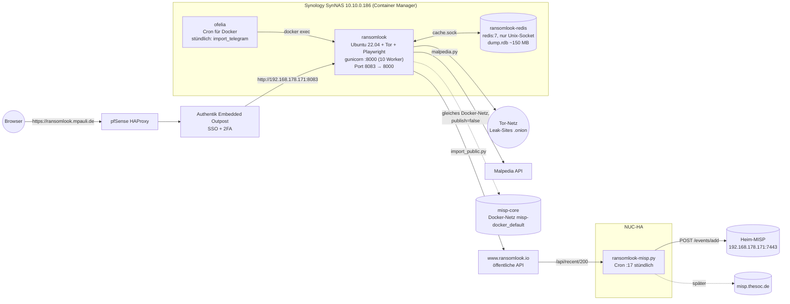
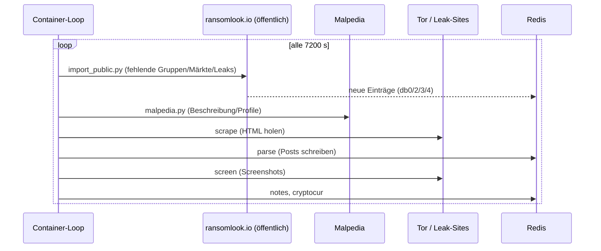

# 01 – Architektur

RansomLook crawlt Leak-Sites von Ransomware-Gruppen (über Tor), wertet sie mit gruppenspezifischen Parsern aus und stellt Gruppen, Posts, Märkte, Krypto-Wallets und Erpresserbriefe per Web-UI und REST-API bereit.

## Überblick

## Container

| Container | Image | Aufgabe |
|---|---|---|
| `ransomlook-ransomlook-1` | lokal gebaut (`ubuntu:22.04`) | Tor, Scraper/Parser, Website (gunicorn) |
| `ransomlook-redis` | `redis:7` | Datenhaltung, **nur Unix-Socket** (`port 0`), Konfig `cache/cache.conf` |
| `ransomlook-ofelia-1` | `mcuadros/ofelia:latest` | Cron-Job `import-telegram` stündlich per `docker exec` |

Docker-Netze: `ransomlook_default` (intern) und das **externe** Netz `misp-docker_default` (muss existieren, sonst startet Compose nicht – gehört zum MISP-Stack auf dem Synology).

## Verzeichnislayout (`/volume2/docker/RansomLook`)

| Pfad | Inhalt | Persistent/Sichern? |
|---|---|---|
| `config/generic.json` | Konfiguration inkl. Secrets | **ja, geheim** |
| `cache/` | `cache.conf`, `dump.rdb` (Redis-Daten), Socket/PID | **ja** (`dump.rdb`) |
| `data/` | z. B. `telegram.txt` (Kanal-Liste) | ja |
| `source/` | gecachte Roh-HTML der Leak-Sites (~40 MB) | nein, neu erzeugbar |
| `source/screenshots/` | Screenshots (~250 MB) | nein, neu erzeugbar |
| `tools/` | Hilfsskripte, **read-only** in den Container gemountet | aus Repo |
| `ransomlook/sharedutils.py` | gepatchte Datei, read-only gemountet | aus Repo |
| `telegram_session.session` | Telethon-Login | **geheim**, nur falls Telegram genutzt wird |

## Redis-Datenbanken

| DB | Inhalt |
|---|---|
| 0 | Gruppen (Metadaten, Standorte/`locations`) |
| 2 | Posts je Gruppe/Markt |
| 3 | Märkte/Foren |
| 4 | Leaks (Data Breaches) |
| 5 | Telegram-Kanäle |
| 6 | Telegram-Nachrichten |

Persistenz: `save 3600 1` (Snapshot, wenn in einer Stunde ≥1 Änderung), **kein** AOF. Ein Crash verliert also bis zu eine Stunde.

## Zyklus im Container

Der Container-Befehl (`docker-compose.yml`) startet Tor und das Backend (`poetry run start`) und läuft danach in einer Dauerschleife (Intervall 2 h):

Fehler einzelner Schritte werden nur geloggt (`|| echo "... failed"`), die Schleife läuft weiter. Viele `net::ERR_TIMED_OUT` im Log sind bei Onion-Seiten normal.

## Ports

| Port | Wo | Zweck |
|---|---|---|
| 8083/tcp | Synology-Host | Web-UI + `/api/*` (→ Container 8000) |
| 8000/tcp | Container | gunicorn |
| Unix-Socket | `cache/cache.sock` | Redis (kein TCP) |

> Hinweis: Die Startseite `/` braucht unter Last ca. 7–8 s, `/api/*` antwortet in unter 1 s. Das ist kein Ausfall.
