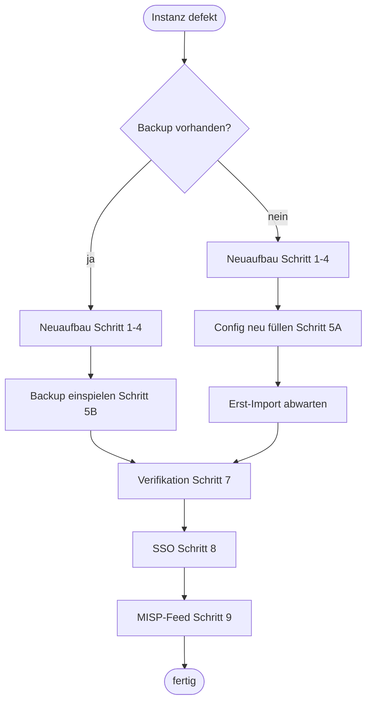

# 02 – Wiederherstellung Schritt für Schritt

Zwei Wege: **A) Neuaufbau mit Neu-Import** (immer möglich, Daten kommen von ransomlook.io und per Crawl neu) und **B) Restore aus Backup** (behält eigene Historie, Telegram-Session, Config).



## Voraussetzungen

- Synology mit **Container Manager** (Docker) und SSH-Zugang als Admin/root.
- Das Docker-Netz **`misp-docker_default`** existiert (MISP-Stack läuft). Prüfen: `docker network ls | grep misp`. Falls MISP nicht (mehr) existiert: `docker network create misp-docker_default` (oder in `docker-compose.yml` den `misp`-Block entfernen).
- Ausgehend: Internet, Tor-Bridges nicht nötig (Tor läuft im Container), DNS 1.1.1.1/8.8.8.8 erreichbar.
- Platz: ca. 3 GB für Image, ca. 0,5 GB für Daten.
- Ein **Malpedia-API-Key** (kostenloser Account bei malpedia.caad.fkie.fraunhofer.de), optional MISP-API-Key, SMTP-Zugang für Mail-Alerts.

## 1 – Repo holen

```sh
cd /volume2/docker
git clone https://github.com/icepaule/IceRansomlook.git
```

## 2 – Verzeichnis aus Fork + Overlay aufbauen

```sh
sh IceRansomlook/scripts/bootstrap.sh /volume2/docker/RansomLook
```

Das Skript klont den Fork, checkt Commit **`de8d93d`** aus (Basis des Overlays), wendet `deploy/patches/0001-local-modifications.patch` an und kopiert Compose, Entrypoint, Ofelia-Job, `import_public.py` und die Config-Vorlage an die richtige Stelle. Es bricht ab, wenn das Ziel schon existiert (nichts wird überschrieben).

> Warum nicht der neueste Fork-Stand? Der Overlay wurde auf `de8d93d` entwickelt und läuft damit. Ein Update auf neuere Upstream-Stände ist ein eigener, ungetesteter Schritt (siehe Doku 06).

## 3 – Konfiguration

`/volume2/docker/RansomLook/config/generic.json` bearbeiten. Mindestens:

| Feld | Wert |
|---|---|
| `malpedia` | eigener Malpedia-API-Key |
| `misp.url` | `https://misp-core/` (Containername im Netz `misp-docker_default`) |
| `misp.apikey` | Auth-Key eines MISP-Users, **oder** `misp.enable` auf `false` |
| `misp.publish` | `false` |
| `email.*`, `email_smtp_auth.*` | SMTP-Relay und Empfänger (nur für Mail-Alerts) |
| `siteurl` | `http://10.10.0.186:8083` |
| `website_listen_port` | `8000` (nicht ändern, Compose mappt 8083→8000) |

Rechte: `chmod 600 config/generic.json`.

## 4 – Bauen und starten

```sh
cd /volume2/docker/RansomLook
docker compose build        # je nach DSM-Version auch: docker-compose build
docker compose up -d
docker compose logs -f ransomlook
```

Der Build dauert mehrere Minuten (Ubuntu-Pakete, Poetry, `playwright install` lädt Chromium). Der Redis-Container muss zuerst laufen; `entrypoint.sh` wartet auf `cache/cache.sock`.

Erwartung im Log: `Redis ready`, danach `Importing …`, dann Tor/Scraper-Meldungen und schließlich `cycle done …`.

## 5A – Ohne Backup: Erst-Import abwarten

`tools/import_public.py` holt beim ersten Zyklus alle fehlenden Gruppen, Märkte, Posts und Leaks von ransomlook.io (öffentliche Endpunkte, ohne Key). Das dauert, da pro Gruppe ein Request mit Pause läuft und die Leak-Liste mehrere tausend Einträge hat. Fortschritt im Log (`  50/…`).

## 5B – Mit Backup einspielen

```sh
cd /volume2/docker/RansomLook
docker compose down
tar xzf /pfad/zu/ransomlook-YYYYMMDD-HHMMSS.tar.gz -C .
# Rechte für Redis-Daten (Container-User 999)
chown -R 999 cache
docker compose up -d
```

Das Archiv (siehe `scripts/backup.sh`) enthält `config/`, `data/`, `cache/dump.rdb`, die Compose-/Tool-Dateien und – falls vorhanden – die Telegram-Session.

## 6 – Optional: Telegram

`ofelia.ini` ruft stündlich `tools/import_telegram.py` auf, das `data/telegram.txt` liest (Format je Zeile `x|https://t.me/<name>|x|Beschreibung`, Zeilen mit weniger als 4 Feldern werden übersprungen). Für `fetch_telegram_groups.py` werden `TELEGRAM_API_ID`/`TELEGRAM_API_HASH` in einer `.env` benötigt (eigene Telegram-App unter my.telegram.org) und eine Telethon-Session `telegram_session.session`. Beides ist **nicht** im Repo.

## 7 – Verifikation

```sh
curl -s -o /dev/null -w '%{http_code}\n'  http://10.10.0.186:8083/api/groups      # 200, schnell
curl -s -m 60 -o /dev/null -w '%{http_code} %{time_total}s\n' http://10.10.0.186:8083/   # 200, einige Sekunden
curl -s http://10.10.0.186:8083/api/stats | head -c 300
docker exec ransomlook-redis redis-cli -s /ransomlook/cache/cache.sock -n 0 DBSIZE      # Gruppen > 0
docker compose ps                                                                        # alle Up
```

Die Startseite ist langsam (ca. 7 s) – normal.

## 8 – Externer Zugriff (SSO)

Siehe [05-sso-und-extern.md](05-sso-und-extern.md). Kurz: Authentik-Provider+App `ransomlook` per `/opt/sso-gate.sh` anlegen, Zertifikat und HAProxy-Backend setzen.

## 9 – MISP-Feed (NUC-HA)

Siehe [04-misp-feed.md](04-misp-feed.md). Kurz: `misp-feed/` nach `/opt/ransomlook-misp/` kopieren, `targets.json` und Key-Datei anlegen, Cron installieren.

## Rollback/Notfall

- Container kaputt, Daten ok: `docker compose up -d --build --force-recreate`.
- Redis-Daten korrupt: `docker compose down`, `cache/dump.rdb` aus Backup zurückspielen, `chown 999`, starten.
- Alles weg, kein Backup: Weg A. Verloren gehen nur eigene Historie (Posts, die ransomlook.io nicht mehr führt), Screenshots und die Telegram-Session.
