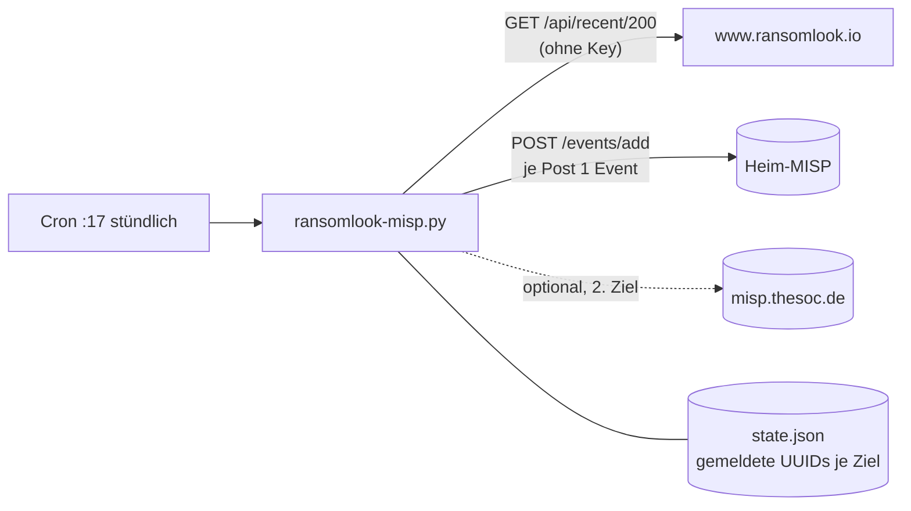

# 04 – MISP-Feed (neue Posts → MISP-Events)

`misp-feed/ransomlook-misp.py` läuft auf **NUC-HA** unter `/opt/ransomlook-misp/` und legt für jeden neuen Leak-Site-Post ein MISP-Event an.



## Verhalten

- Quelle: `https://www.ransomlook.io/api/recent/200` (letzte 200 Posts, **ohne API-Key**). Bei ca. 200 Posts pro Tag reicht das stündlich; fällt der Cron länger als einen Tag aus, gehen Posts verloren (dann `RL_RECENT=1000` setzen).
- **Event-UUID = `misp_uuid` des Posts** aus RansomLook. MISP lehnt dieselbe UUID ab → Duplikate sind auch ohne `state.json` ausgeschlossen (getestet).
- Pro Event: Info `RansomLook: <gruppe> - <opfer>`, Datum, `distribution=0` (nur eigene Organisation), `threat_level=3`, `analysis=2`.
- Attribute (alle `to_ids=False`): Opfername (`text`), Link zur Gruppenseite (`link`), Beschreibung (`comment`, max. 1500 Zeichen).
- Tags: `ransomware`, `tlp:clear`, `source:ransomlook`, `ransomware-group:<gruppe>`. Die Taxonomien sind im Heim-MISP deaktiviert, die Tags werden als Freitext angelegt (MISP normalisiert `ransomware` zu `Ransomware`).
- Private Posts (`private: true`) und Posts ohne `misp_uuid` werden übersprungen.
- **Bewusst keine IOCs:** Opfernamen dürfen nicht in die IOC-Feeds für AdGuard/pfBlockerNG laufen (die ziehen `to_ids=1`-Attribute).

## Installation

```sh
mkdir -p /opt/ransomlook-misp
cp misp-feed/ransomlook-misp.py /opt/ransomlook-misp/
cp misp-feed/targets.json.example /opt/ransomlook-misp/targets.json
chmod +x /opt/ransomlook-misp/ransomlook-misp.py
# Auth-Key des MISP-Users in eine Datei (nur root lesbar):
install -m 600 /dev/null /opt/ransomlook-misp/heim-misp.key
printf '%s' 'DEIN_MISP_AUTHKEY' > /opt/ransomlook-misp/heim-misp.key
cp misp-feed/ransomlook-misp.cron /etc/cron.d/ransomlook-misp
```

`targets.json` anpassen (`url`, `key_file`, `verify_tls`). In der laufenden Installation zeigt `key_file` auf den bereits vorhandenen Key des IOC-Syncs (`/opt/misp-ioc-sync/misp_api_key.txt`), Ziel ist das Heim-MISP auf dem Synology.

## Erster Lauf

Der erste Lauf legt bis zu 200 Events an und dauert rund **6 Minuten** (ca. 1,8 s je Event). Im Hintergrund starten oder `RL_RECENT=3` zum Testen:

```sh
cd /opt/ransomlook-misp && RL_RECENT=3 python3 ransomlook-misp.py
```

Prüfung: in MISP unter Events nach `RansomLook:` suchen, oder per API `POST /events/restSearch` mit `{"eventinfo":"RansomLook:%"}`.

## Zweites Ziel `misp.thesoc.de` (offen)

`misp.thesoc.de` ist eine **andere** MISP-Instanz als das Heim-MISP; die vorhandenen Keys werden dort abgelehnt. Sobald ein Key vorliegt, in `targets.json` ergänzen:

```json
{"name": "thesoc", "url": "https://misp.thesoc.de", "key_file": "/opt/ransomlook-misp/thesoc.key", "verify_tls": true}
```

Das Skript führt pro Ziel eine eigene State-Liste und füllt beim ersten Lauf nach. Vorher entscheiden, ob `distribution` für diese Instanz angepasst werden soll (aktuell fest `0`).

## Fehlersuche

| Symptom | Ursache/Lösung |
|---|---|
| `Authentication failed` | Key falsch oder User nicht API-fähig |
| `FAIL … 403` ohne „already exists“ | Rolle des Users darf keine Events anlegen |
| `ransomlook fetch failed` | ransomlook.io nicht erreichbar; nächster Lauf holt nach |
| Log | `/var/log/ransomlook-misp.log` |
