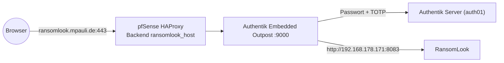

# 05 – Externer Zugriff (Authentik SSO + 2FA)

Die Instanz selbst hat **keine Benutzerverwaltung** (`users: {}`) und intern **keinen Login**. Schutz nach außen übernimmt Authentik als Proxy-Provider.



## Eingerichtet mit `sso-gate.sh`

Das Hilfsskript `/opt/sso-gate.sh` (NUC-HA) legt alles in einem Schritt an:

```sh
/opt/sso-gate.sh ransomlook ransomlook.mpauli.de http://192.168.178.171:8083
```

Es erzeugt:

1. **Authentik:** Proxy-Provider + Application `ransomlook` (`mode=proxy`, `external_host=https://ransomlook.mpauli.de`, `internal_host=http://192.168.178.171:8083`, Flow `default-provider-authorization-implicit-consent`, `intercept_header_auth` an, **kein** `skip_path_regex`), angehängt an den *Embedded Outpost*.
2. **DNS:** A-Record bei Hetzner DNS (Zone mpauli.de) auf die Heim-IP; wird per DDNS-Skript aktuell gehalten.
3. **Zertifikat:** Let's Encrypt via `acme.sh` (DNS-01, Plugin `dns_mphcloud`), Deploy per `/opt/sso-cert-deploy.sh ransomlook.mpauli.de`; Erneuerung automatisch.
4. **HAProxy (pfSense):** Backend `ransomlook_host` → Outpost :9000, passende ACL für den Hostnamen.

## Wichtig

- Intern ist `http://10.10.0.186:8083` **ohne Authentifizierung** erreichbar, inklusive der kompletten API. Das ist gewollt (LAN), aber kein Zugriff aus untrusted Netzen zulassen.
- Weil kein `skip_path_regex` gesetzt ist, verlangt auch `/api/*` über die externe URL den SSO-Login. Programmatischer Zugriff von außen funktioniert daher nur mit Browser-Session; intern direkt auf Port 8083.
- Bei Neuaufbau des Authentik-Providers genügt es, den Befehl oben erneut auszuführen (das Skript erkennt vorhandene Apps und bricht ab bzw. überspringt).
